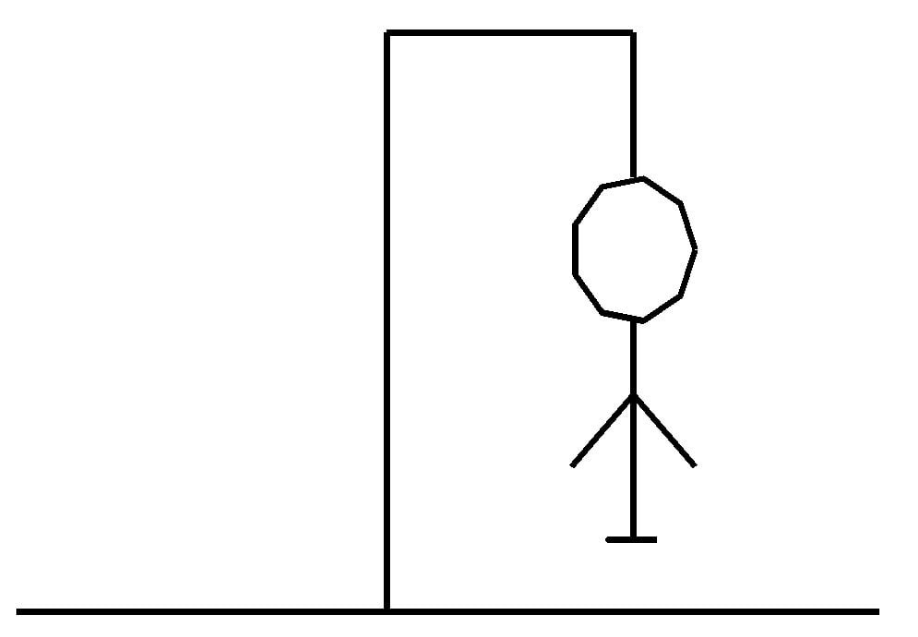

```{r setup, include=FALSE}
knitr::opts_chunk$set(echo = TRUE)
```

# Instalação

ggplot2 is a system for declaratively creating graphics, based on The Grammar of Graphics. You provide the data, tell ggplot2 how to map variables to aesthetics, what graphical primitives to use, and it takes care of the details.

Instalar via CRAN
```{r eval=FALSE}
install.packages("ggplot2")
```

# Aplicação

It's hard to succintly describe how ggplot2 works because it embodies a deep philosophy of visualisation. However, in most cases you start with ggplot(), supply a dataset and aesthetic mapping (with aes()). You then add on layers (like geom_point() or geom_histogram()), scales (like scale_colour_brewer()), faceting specifications (like facet_wrap()) and coordinate systems (like coord_flip()).


```{r eval=FALSE}
library(ggplot2)

ggplot(mpg, aes(displ, hwy, colour = class)) + 
  geom_point()
```


# Exemplo jogo da forca

Hangman is a classic word game in which you need to need to guess as many possible letters in word, so you can guess the word, before running out of tries (lives).The game can be played in R Studio, where the user inputs new letters in console, and the picture is being drawn (using library ggplot2). The picture consists of 7 false tries, so  it is drawn in 7 steps.




