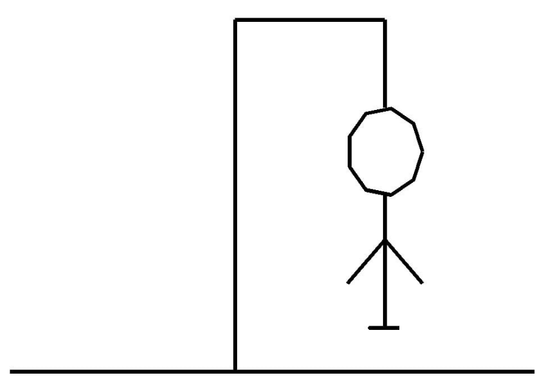

# Instalação

ggplot2 é um sistema para a criação declarativa de gráficos, baseado na
Gramática dos Gráficos. Você fornece os dados, diz ao ggplot2 como
mapear as variáveis ​​para a estética, quais primitivos gráficos usar e
ele cuida dos detalhes.

Instalar via CRAN

    install.packages("ggplot2")

# Aplicação

É difícil descrever sucintamente como o ggplot2 funciona porque ele
incorpora uma profunda filosofia de visualização. No entanto, na maioria
dos casos, você começa com ggplot (), fornece um conjunto de dados e um
mapeamento estético (com aes ()). Você então adiciona camadas (como
geom\_point () ou geom\_histogram ()), escalas (como
scale\_colour\_brewer ()), especificações de facetas (como facet\_wrap
()) e sistemas de coordenadas (como coord\_flip ()).

    library(ggplot2)

    ggplot(mpg, aes(displ, hwy, colour = class)) + 
      geom_point()

# Exemplo jogo da forca

Hangman é um jogo de palavras clássico no qual você precisa adivinhar o
maior número possível de letras, para que possa adivinhar a palavra,
antes de ficar sem tentativas (vidas). novas letras no console, e a
imagem está sendo desenhada (usando a biblioteca ggplot2). A imagem
consiste em 7 tentativas falsas, por isso é desenhada em 7 etapas.

